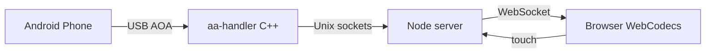

# Web-Based Android Auto Head Unit

USB Android Auto head unit for Raspberry Pi (4/5, 64-bit) with a browser UI. The phone connects over USB; video (H.264) and audio (PCM) stream to any modern browser on your LAN via WebSockets. Touch input is sent back to the phone.



## Hardware

- Raspberry Pi 4 or 5 with **64-bit** OS
- **Data** USB cable (not charge-only)
- Powered USB hub recommended if you see failed re-enumeration

## Phone setup

1. Install **Android Auto** from Play Store.
2. **Settings → Apps → Android Auto** → tap version **10 times** → Developer settings.
3. Enable **Unknown sources** (required for uncertified head units).
4. USB mode: avoid “charge only”; disable USB debugging if AOA fails on some OEMs.

You will see an **uncertified head unit** warning the first time — expected.

## Quick start (Pi / Linux)

### 1. Host USB setup (one time per machine)

The udev rules ship in this repo but must be installed on the **Linux host** that owns the USB port (Docker cannot do this from inside the container).

```bash
sudo ./scripts/install-host-usb.sh
```

This copies [`config/99-android-auto-headunit.rules`](config/99-android-auto-headunit.rules) to `/etc/udev/rules.d/` and reloads udev. Optional: adds your user to the `plugdev` group.

Check before plugging in a phone:

```bash
./scripts/preflight-usb.sh
```

### 2. Run the head unit (USB already in compose)

`docker compose up` is the normal command — you do **not** pass extra `--device` flags on the CLI. Bus-level USB is already defined in [`docker-compose.yml`](docker-compose.yml) for the default `headunit` service:

- `privileged: true`
- `devices: /dev/bus/usb:/dev/bus/usb`
- `volumes: /dev/bus/usb:/dev/bus/usb` (so new device nodes appear after AOA re-enumeration)

```bash
# Pull prebuilt image (after CI publish) or build locally:
docker buildx build --platform linux/amd64,linux/arm64 \
  -t ghcr.io/mrgraxen/android-auto:latest .

docker compose up -d
# Open http://<pi-ip>:8080
```

**Stub mode (no USB):** `docker compose --profile stub up` — uses `headunit-stub`, which omits USB mounts on purpose.

**Hardened USB (after it works):** `docker compose --profile cap_usb up` — `privileged: false` but `SYS_ADMIN` + same bus mounts.

### USB / AOA (critical)

Android Auto switches the phone to **Google accessory mode** (`18d1:2d00` / `2d01`). The device **disconnects and reconnects** — this is normal.

**Do not** change compose to map a single device like `/dev/bus/usb/001/002` — that path disappears when the phone switches mode.

Verify:

```bash
docker exec headunit lsusb          # before plug: no phone
# plug phone
docker exec headunit lsusb          # after ~2s: Google Inc. 18d1:2d00
docker logs headunit 2>&1 | tail -30
```

See [docs/HARDWARE_TEST.md](docs/HARDWARE_TEST.md).

## Stub mode (dev without phone)

```bash
AA_STUB=1 docker compose --profile stub up
# Or on Windows/macOS Docker Desktop for UI work only:
AA_STUB=1 npm run build --workspace=server
AA_STUB=1 CONFIG_PATH=config/config.yaml HTTP_PORT=8080 node server/dist/index.js
```

Open http://localhost:8080

## Configuration

Edit [`config/config.yaml`](config/config.yaml):

- `video.width` / `height` — advertised to phone (1280×720 default)
- `server.access_token` — if set, required as `?token=` on HTTP and WebSocket
- `server.bind_localhost_only` — bind 127.0.0.1 only

## Security

- **Trusted LAN only** — no auth by default; anyone on Wi‑Fi can view/control.
- Set `server.access_token` and use `?token=...` in the browser URL.
- Do not expose port 8080 to the internet without TLS + reverse proxy.

## Build from source

```bash
# Do not docker build on Pi for daily dev — use CI arm64 images
docker buildx build --platform linux/amd64,linux/arm64 \
  -t ghcr.io/mrgraxen/android-auto:latest --push .

npm install
node scripts/generate-fixtures.js
npm test
```

### Scripts

| Script | Purpose |
|--------|---------|
| [`scripts/install-host-usb.sh`](scripts/install-host-usb.sh) | One-time udev install on Linux host (`sudo`) |
| [`scripts/preflight-usb.sh`](scripts/preflight-usb.sh) | Verify udev + list USB devices before test |
| [`scripts/generate-fixtures.js`](scripts/generate-fixtures.js) | Regenerate stub H.264/PCM samples |
| [`scripts/entrypoint.sh`](scripts/entrypoint.sh) | Container entrypoint (aa-handler + server) |

## Architecture

| Component | Role |
|-----------|------|
| `aa-handler/` | aasdk + Android Auto services → Unix sockets |
| `server/` | Node.js — IPC → WebSocket bridge, static UI |
| `frontend/` | WebCodecs + Web Audio + touch |

## Known limitations

- USB in Docker on **macOS/Windows** is unreliable — use stub mode locally, Pi for real USB.
- **Bluetooth** stub only — calls may not route; USB projection is the focus.
- **Microphone** back to phone not supported.
- Wireless Android Auto not supported (v1).

## License

This project is free software licensed under the **GNU General Public License v3.0 or later** ([LICENSE](LICENSE)).

Third-party notices: [NOTICE](NOTICE).
